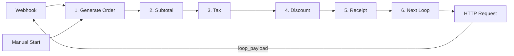
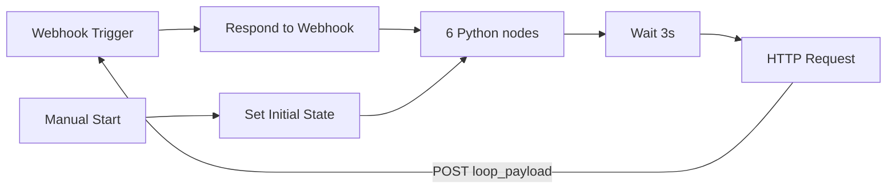

# n8n Python Testing Workflows

Sample n8n workflows for testing **Python Code nodes**, **linear data passing** (output of node N → input of node N+1), and **continuous loops**.

---

## Workflow 1: Linear Order Pipeline (recommended)

**Use case:** Simple order receipt calculator — each node adds one thing to the order and passes it to the next.

| Node | Input | Output |
|------|-------|--------|
| 1. Generate Order | `cycle` from loop | `order_id`, `item`, `quantity`, `unit_price` |
| 2. Calculate Subtotal | order | order + `subtotal` |
| 3. Add Tax | order + subtotal | order + `tax_amount`, `total_before_discount` |
| 4. Apply Discount | order + tax | order + `discount_amount`, `final_total` |
| 5. Format Receipt | complete order | order + `receipt` (text) |
| 6. Prepare Next Loop | receipt | `loop_payload` → feeds back into Node 1 |

### Flow: 1 → 2 → 3 → 4 → 5 → 6 → 1



Each Python node reads `_items[0]["json"]` from the previous node and returns one output item for the next.

**Import:** `workflows/linear-order-pipeline.json`

**Python sources:** `python-nodes/linear/01_generate_order.py` … `06_prepare_next_loop.py`

**Stop:** Deactivate the workflow.

---

## Workflow 2: Continuous Sensor Pipeline

A sample n8n workflow with **6 Python Code nodes** that runs in a **continuous self-loop** until you manually stop it. Built for testing n8n Python execution, data passing between nodes, and long-running workflow patterns.

## Suggested use case

**Continuous IoT Sensor Simulation & Anomaly Detection Pipeline**

This workflow simulates a miniature data pipeline that might run on edge devices or in a monitoring stack:

| Step | Python node | What it does |
|------|-------------|--------------|
| 1 | Generate Sensor Data | Creates 5 fake sensor readings per cycle (temperature, humidity, pressure, voltage) |
| 2 | Validate Readings | Checks schema, types, and value ranges |
| 3 | Normalize Readings | Applies calibration offsets and scaling |
| 4 | Detect Anomalies | Flags outliers using z-score analysis |
| 5 | Aggregate Metrics | Computes min/max/avg per sensor type |
| 6 | Format Report | Builds a text report and prepares the next loop payload |

Each cycle produces a readable report you can inspect in the **Executions** tab — useful for verifying that Python nodes, data flow, and looping all work correctly.

## How the continuous loop works



1. **Start** — Click **Manual Start** (first cycle) or POST to the webhook URL.
2. **Process** — All 6 Python nodes run in sequence.
3. **Wait** — Pauses 3 seconds to avoid hammering your instance.
4. **Loop** — The HTTP Request node POSTs `loop_payload` (`cycle + 1`) back to the webhook URL.
5. **Repeat** — The webhook fires again and the pipeline runs the next cycle.

**To stop:** Toggle the workflow to **Inactive** in n8n. No further webhook executions will run.

> **Note:** The loop uses a self-triggering webhook pattern (recommended by the n8n community for continuous workflows). The **Respond to Webhook** node replies immediately so executions don't pile up and block your worker queue.

## Quick start

### 1. Import the workflow

In n8n: **⋯ menu → Import from File** → select:

```
workflows/continuous-sensor-pipeline.json
```

### 2. Configure the loop-back URL

1. Open the **Webhook Trigger** node and copy the **Production URL** (not the test URL).
2. Open the **Loop Back (HTTP Request)** node.
3. Replace `REPLACE_WITH_YOUR_WEBHOOK_PRODUCTION_URL` with that Production URL.

### 3. Activate and run

1. Toggle the workflow **Active**.
2. Click **Manual Start** on the **Manual Start** node (or POST `{"cycle": 0, "running": true}` to the webhook).
3. Open **Executions** and inspect the output of **6. Format Report** — the `report` field shows a summary per cycle.

### 4. Stop

Toggle the workflow to **Inactive**.

## Requirements

- **n8n v1.111+** (native Python) or **n8n v2** recommended
- Each Code node uses **Language: Python (Native)** (`pythonNative`)
- No external Python packages required — only the standard library (`random`, `math`, `datetime`, `collections`)

If Python nodes fail on self-hosted n8n, ensure [task runners are configured](https://docs.n8n.io/hosting/configuration/task-runners/).

## Python node source files

Each node's code lives in `python-nodes/` for easy copy-paste:

| File | Node |
|------|------|
| `python-nodes/01_generate_sensor_data.py` | 1. Generate Sensor Data |
| `python-nodes/02_validate_readings.py` | 2. Validate Readings |
| `python-nodes/03_normalize_readings.py` | 3. Normalize Readings |
| `python-nodes/04_detect_anomalies.py` | 4. Detect Anomalies |
| `python-nodes/05_aggregate_metrics.py` | 5. Aggregate Metrics |
| `python-nodes/06_format_report.py` | 6. Format Report |

In each Code node, set **Mode** to **Run Once for All Items** and paste the corresponding file contents.

## Example output (cycle 3)

```
=== Sensor Pipeline Report | Cycle 3 ===
Status: DEGRADED
Anomalies: 1
Severity: {'normal': 4, 'warning': 1, 'critical': 0}
  temperature: avg=42.153 min=38.21 max=45.9 (n=2)
  humidity: avg=5.234 min=4.12 max=6.35 (n=1)
  ...
```

## Project structure

```
.
├── README.md
├── workflows/
│   ├── linear-order-pipeline.json          # 1→2→3→4→5→6→1 chain
│   └── continuous-sensor-pipeline.json       # IoT simulation loop
└── python-nodes/
    ├── linear/                               # Order pipeline nodes
    │   ├── 01_generate_order.py
    │   ├── 02_calculate_subtotal.py
    │   ├── 03_add_tax.py
    │   ├── 04_apply_discount.py
    │   ├── 05_format_receipt.py
    │   └── 06_prepare_next_loop.py
    ├── 01_generate_sensor_data.py
    ├── 02_validate_readings.py
    ├── 03_normalize_readings.py
    ├── 04_detect_anomalies.py
    ├── 05_aggregate_metrics.py
    └── 06_format_report.py
```
